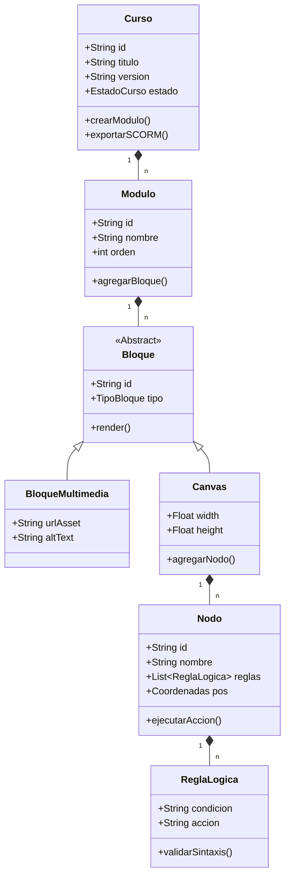
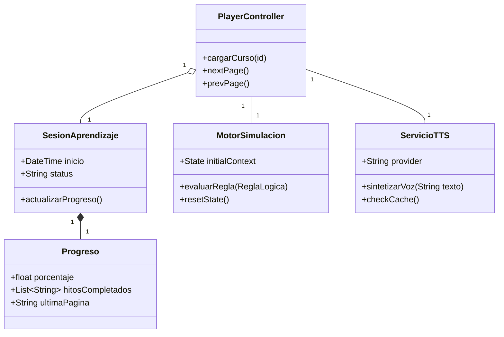
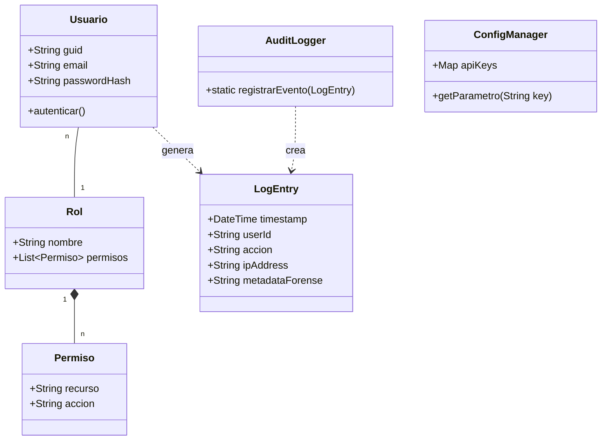

# Diagramas de Clase y Actividad - VizApp (Análisis Punto 4)

Este documento detalla la estructura estática (clases) y dinámica (actividad) del sistema VizApp, estructurado por subsistemas y procesos críticos.

## 1. Diagramas de Clase por Subsistema

### 1.1 SUB-01: Gestión de Contenidos (Editor Core)
Este diagrama muestra la jerarquía de contenidos y la estructura del motor de simulación gráfica.



### 1.2 SUB-02: Reproducción e Interactividad (Player Context)
Estructura necesaria para gestionar la sesión del estudiante y el estado de la simulación.



### 1.3 SUB-03: Administración, Seguridad y Reportes (Core Services)
Modelado de la gobernanza, auditoría forense y persistencia técnica.



---

## 2. Diagramas de Actividad (Casos de Uso Críticos)

### 2.1 CU-08: Configuración Lógica de Nodos (Editor)
Describe el proceso de programación visual de comportamientos reactivos.

```mermaid
activityDiagram
|Docente|
start
:Seleccionar Nodo en Canvas;
:Abrir Panel de Propiedades Lógicas;
:Ingresar Regla (Gramática Simplificada);
if (¿Sintaxis Válida?) then (Sí)
    :Realizar Chequeo Semántico;
    if (¿Conflictos Lógicos?) then (No)
        :Serializar Regla a JSON;
        :Confirmar Guardado;
        stop
    else (Sí)
        :Mostrar Error de Lógica;
        detach
    endif
else (No)
    :Resaltar Error de Sintaxis;
    stop
endif
```

### 2.2 CU-14: Publicación y Versionado (SCORM/LTI)
El flujo de empaquetado final para integración con LMS.

```mermaid
activityDiagram
|Docente/Admin|
start
:Solicitar Publicación de Versión;
|Sistema|
:Ejecutar Chequeo de Integridad;
if (¿Existen Errores Críticos?) then (Sí)
    :Mostrar Lista de Bloqueos;
    stop
else (No)
    :Compilar Objeto JSON Definitivo;
    :Generar Manifiesto (imsmanifest.xml);
    :Comprimir Assets en .ZIP;
    :Registrar Versión en DB;
    :Notificar a Auditoría (CU-06);
    :Generar Enlace de Descarga;
    stop
endif
```

### 2.3 CU-04: Reproducción de Audio TTS con Fallback
Lógica de resiliencia para asegurar la accesibilidad.

```mermaid
activityDiagram
|Estudiante|
start
:Clic en Icono de Audio;
|Sistema|
:Consultar Caché Local;
if (¿Audio Existe?) then (Sí)
    :Cargar desde Almacenamiento;
else (No)
    :Verificar API TTS Externa;
    if (¿Disponible y Con Saldo?) then (Sí)
        :Solicitar Stream de Audio;
        :Almacenar en Caché;
    else (No)
        :Fallback: Web Speech API (Nativo);
    endif
endif
:Sincronizar Highlight de Texto;
:Reproducir Audio;
stop
```
