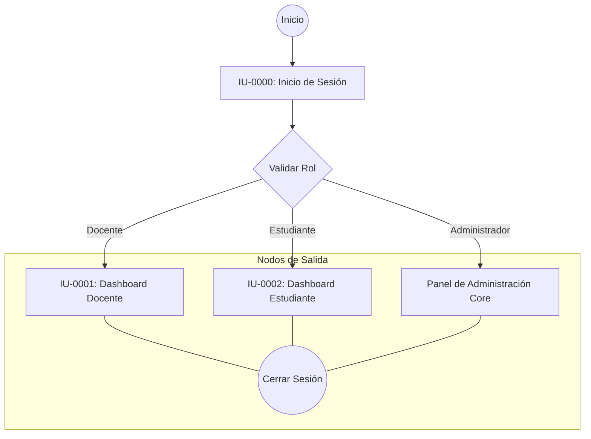
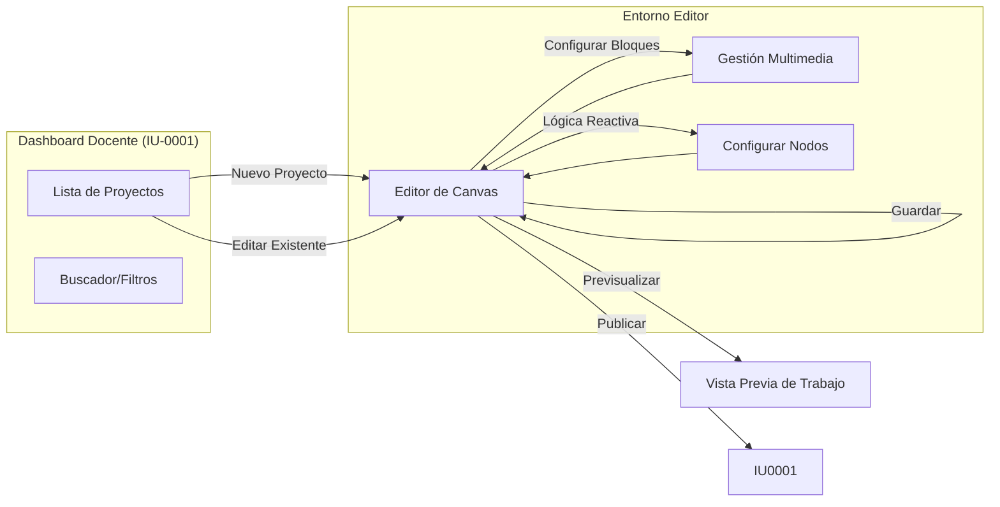
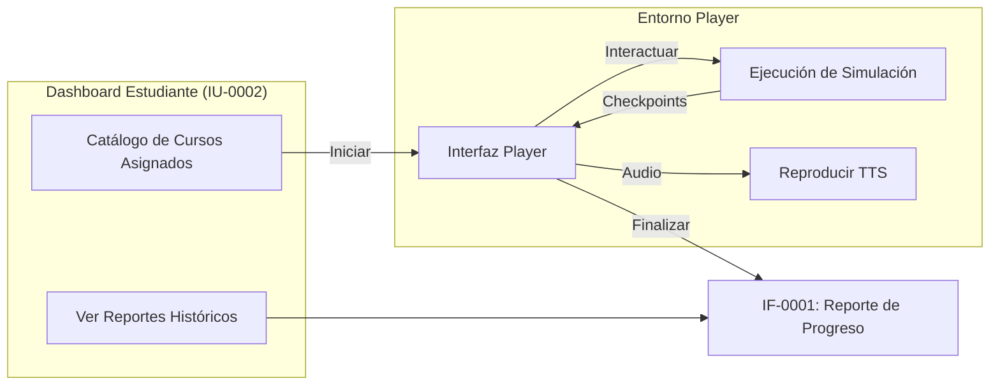
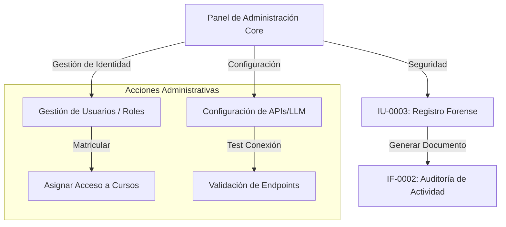

# Diagramas de Navegación del Sistema VizApp

Este documento describe el flujo de navegación entre los distintos módulos de VizApp, estructurado por los subsistemas de análisis y alineado con la especificación de interfaces.

## 1. Modelo de Navegación Global

Representa el punto de entrada único al sistema y la ramificación de navegación basada en roles.

---

## 2. SUB-01: Gestión de Contenidos (Editor)

Describe el flujo de trabajo del docente para la creación y estructuración de conocimiento.

---

## 3. SUB-02: Reproducción e Interactividad (Player)

Detalla el ciclo de vida del aprendizaje del estudiante, desde la selección del curso hasta la obtención de resultados.

---

## 4. SUB-03: Administración, Seguridad y Reportes (Core)

Visualiza el flujo de gestión técnica y auditoría forense del sistema.

