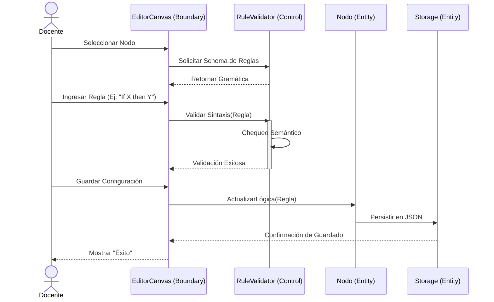
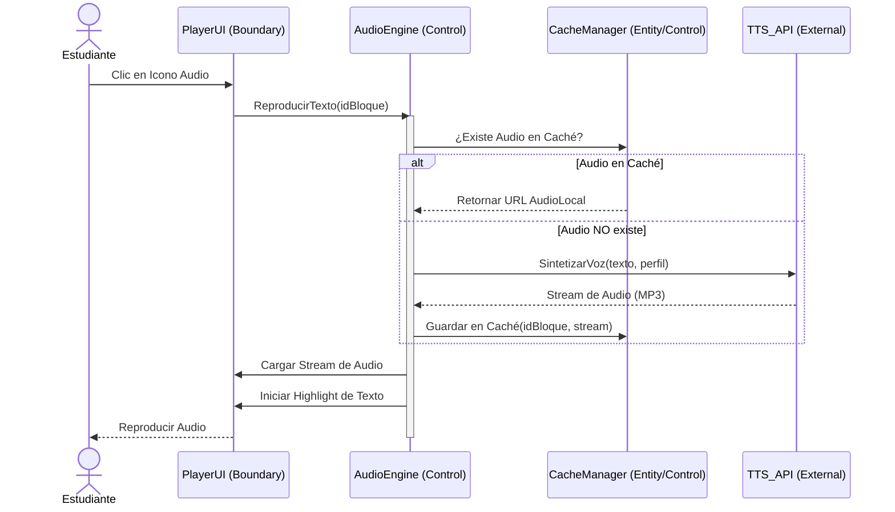
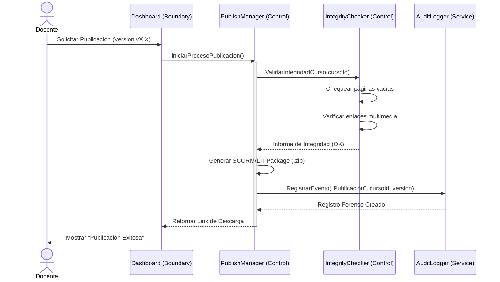
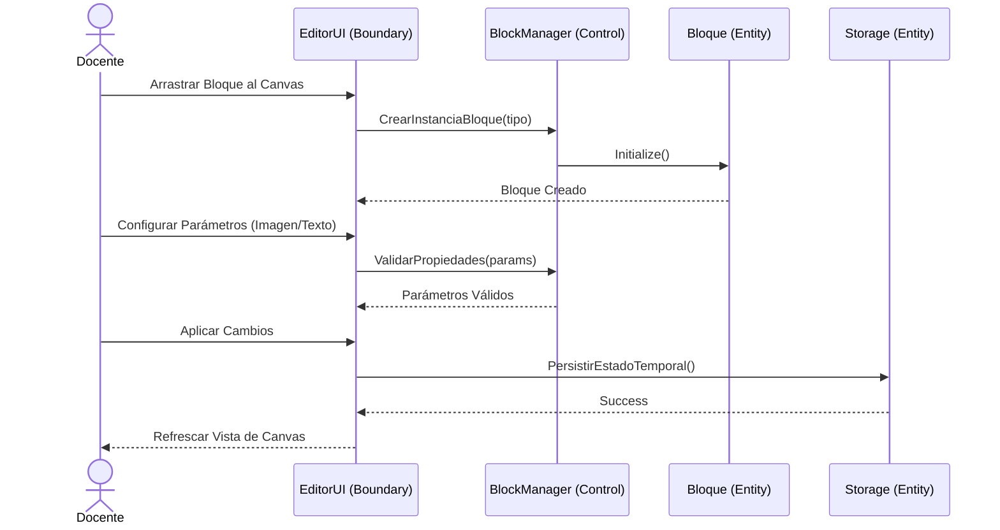

# Diagramas de Secuencia del Sistema VizApp

Este documento describe la interacción dinámica entre los objetos del sistema para cumplir con los procesos de negocio críticos, utilizando los subsistemas y clases definidos en la fase de análisis.

---

## 1. CU-08: Configuración de Lógica Reactiva de Nodos
Modelado de la interacción para programar comportamientos dinámicos en el Canvas.

---

## 2. CU-04: Reproducción de Audio TTS con Gestión de Resiliencia
Orquestación del servicio de voz con estrategia de caché y fallback.

---

## 3. CU-14: Publicación y Versionado (Cierre de Edición)
Flujo de validación e integridad previo a la exportación SCORM.

---

## 4. CU-02: Configuración de Bloques Multimedia
Interacción para añadir y parametrizar componentes en el editor.

