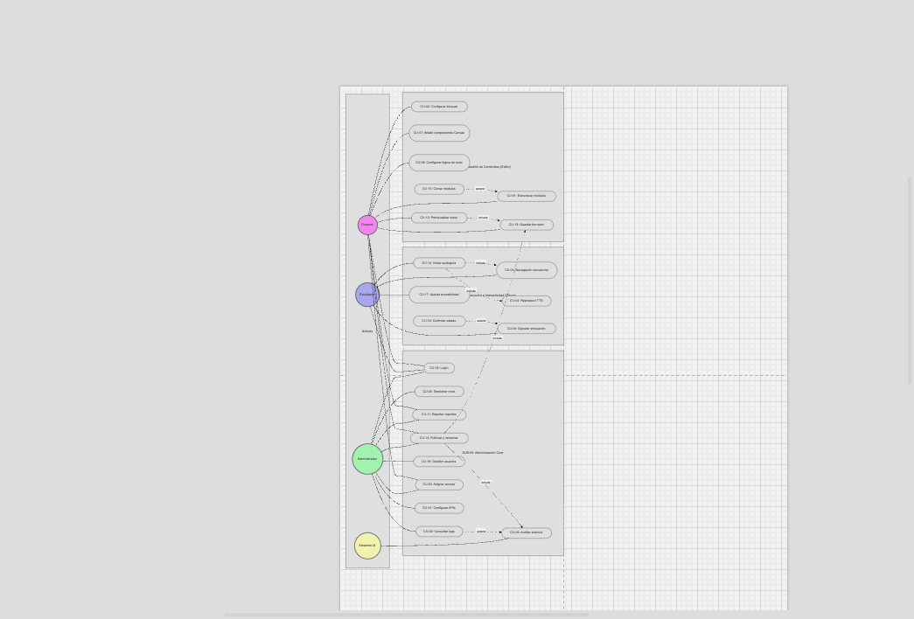
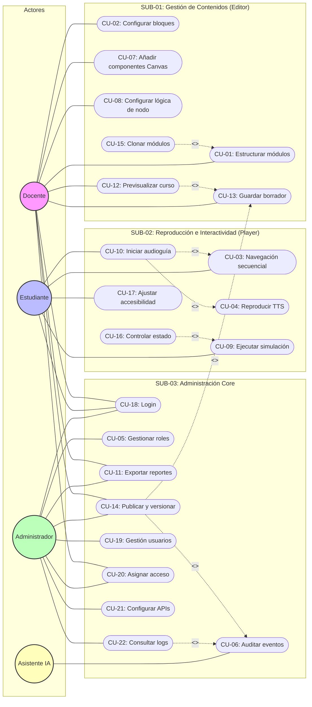

# Diagramas de Casos de Uso - VizApp

## 1. Diagrama General del Sistema (UML)

A continuación se presenta el diagrama de casos de uso de VizApp generado en Draw.io con simbología UML estándar, incluyendo puntos de extensión y relaciones de inclusión.

## 2. Diagrama en Sintaxis Mermaid (Refinado)

Este diagrama modela las dependencias funcionales entre casos de uso mediante relaciones de `include` y `extend`.

## 3. Definición de Relaciones Técnicas

Para una interpretación correcta del modelo UML, se definen las siguientes reglas de negocio:

### Inclusiones (`<<include>>`)
Representan fragmentos de funcionalidad que son **obligatorios** para el caso de uso base.
- **CU-10 (Audioguía)**: Obligatoriamente consume la navegación (CU-03) y el TTS (CU-04).
- **CU-14 (Publicación)**: Requiere el guardado previo (CU-13) y genera un registro forense obligatorio (CU-06).
- **CU-12 (Previsualización)**: Dispara un guardado automático (CU-13) de los cambios actuales.

### Extensiones (`<<extend>>`)
Representan funcionalidades **opcionales** que aumentan el comportamiento del caso de uso base en puntos específicos.
- **CU-15 (Clonar)**: Es una opción avanzada dentro de la gestión de estructura de módulos (CU-01).
- **CU-16 (Reiniciar)**: Acción opcional del estudiante durante la ejecución de una simulación (CU-09).
- **CU-22 (Consultar Logs)**: Funcionalidad de visualización que extiende la capacidad base de auditoría (CU-06).
