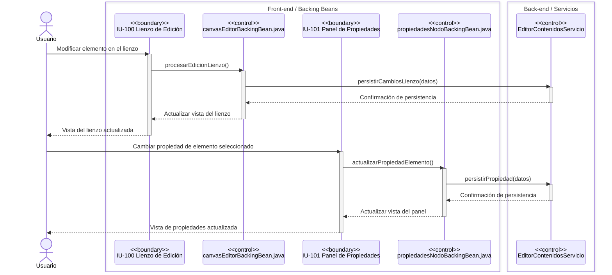
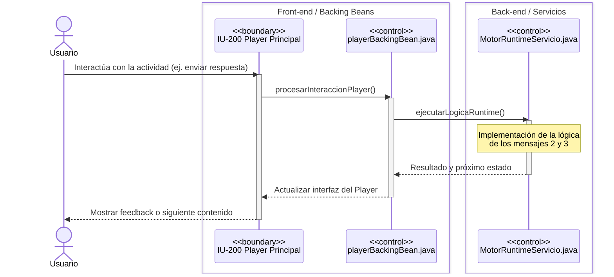
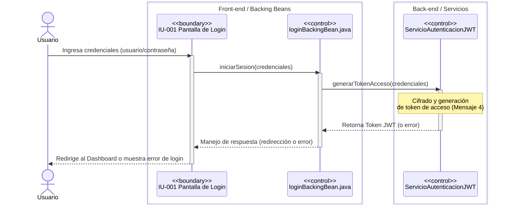

# Diagramas de Interacción (DSI)

## Subsistema SUB-01: Editor de Contenidos

El siguiente diagrama de interacción secuencial corresponde a la Figura 4.2 descrita en el documento DSI. Modela la interacción entre los componentes Boundary (Páginas y controladores) y las operaciones de persistencia delegadas a la clase de servicio.

### Diagrama de Secuencia

**Descripción de los Componentes:**
- **IU-100 – Lienzo de Edición (`canvasEditorBackingBean.java`):** Componente de tipo *Boundary / Controller* responsable de capturar los eventos y acciones directas del usuario sobre el lienzo (como mover, crear o conectar nodos).
- **IU-101 – Panel de Propiedades (`propiedadesNodoBackingBean.java`):** Componente de tipo *Boundary / Controller* que permite al usuario visualizar y editar los atributos específicos del nodo seleccionado.
- **`EditorContenidosServicio`:** Clase de servicio encargada de abstraer y ejecutar todas las operaciones de persistencia o transacciones complejas, separando la lógica de negocio y persistencia de los controladores de la interfaz gráfica.

---

## Subsistema SUB-02: Player / Motor de Ejecución

El siguiente diagrama de interacción secuencial corresponde a la Figura 4.4 descrita en el documento DSI para el Player. Destaca el flujo de ejecución y cómo se delega la lógica central de procesamiento (específicamente la de los mensajes 2 y 3) al servicio del motor en tiempo de ejecución.

### Diagrama de Secuencia

**Descripción de los Componentes:**
- **IU-200 – Player Principal (`playerBackingBean.java`):** Componente de tipo *Boundary / Controller* encargado de presentar el contenido interactivo al usuario y capturar sus respuestas o eventos.
- **Controlador Central (`MotorRuntimeServicio.java`):** Servicio (Control) que implementa el motor de ejecución en tiempo real. Es el responsable de recibir el evento, evaluar la lógica asociada al nodo actual (mensajes 2 y 3) y devolver el estado resultante para que la vista se actualice.

---

## Subsistema SUB-03: Seguridad y Autenticación

El siguiente diagrama de interacción secuencial corresponde a la Figura 4.6 descrita en el documento DSI. Modela el flujo de seguridad, destacando la interacción con la pantalla de login y la delegación de la autenticación al servicio de tokens.

### Diagrama de Secuencia

**Descripción de los Componentes:**
- **IU-001 – Pantalla de Login (`loginBackingBean.java`):** Componente de tipo *Boundary / Controller* que representa la interfaz de autenticación. Captura las credenciales ingresadas por el usuario y gestiona la respuesta (acceso concedido o denegado).
- **Servicio Externo (`ServicioAutenticacionJWT`):** Servicio encargado de la seguridad de la aplicación. Centraliza la lógica de validación, cifrado y generación de tokens de acceso (referenciado como el mensaje 4), permitiendo un manejo de sesiones seguro e independiente de los controladores de vista.

