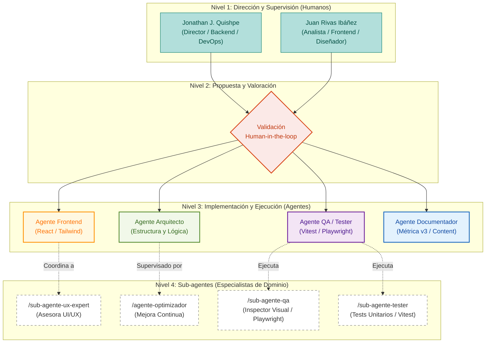

# Organización Formal del Proyecto Viz-App

## 1. Corrección Conceptual: El Rol de QA

Tienes toda la razón. Analizando la estructura formal del proyecto, **el Agente QA / Tester no es un subordinado del Frontend**. Se encuentra exactamente en el mismo nivel jerárquico (**Nivel 3: Implementación y Ejecución**). 

*   El **Frontend** se encarga de *construir* (React, Tailwind).
*   El **QA / Tester** se encarga de *destruir y verificar* (Vitest, Playwright, flujos visuales). 

Son fuerzas contrarias pero complementarias que actúan al mismo nivel. El QA audita al Frontend (y también al Backend o la Lógica del Arquitecto si fuera necesario).

Por lo tanto, la verdadera jerarquía no es que "QA dependa de Frontend", sino que **existen Agentes Generales (Nivel 3)** y, por debajo de ellos, **Sub-agentes Especializados (Nivel 4)**.

---

## 2. Diagrama de Estructura Organizativa (Híbrida)

A continuación, el diagrama actualizado que refleja correctamente los niveles de humanos, el nodo de validación cruzada y la relación entre Agentes y Sub-agentes:

---

## 3. Comprendiendo la Jerarquía (Agentes vs Sub-agentes)

Para que el modelo escale, hemos dividido a la Inteligencia Artificial en dos capas operativas (Nivel 3 y Nivel 4):

### Nivel 3: Agentes (Coordinadores de Dominio)
Son los equivalentes a los "Tech Leads" de cada área. Tienen una visión global de su dominio y son los responsables de entregar el bloque de trabajo al Nivel 2 (Validación Humana).
*   Ejemplo: El **Agente QA / Tester** sabe que un componente necesita tanto validación lógica (*Unit Testing*) como validación de interfaz (*E2E/Visual*).

### Nivel 4: Sub-agentes (Especialistas / Prompts Específicos)
Son herramientas o perfiles hiper-especializados (invocados vía *slash commands* como `/sub-agente-ux-expert` o `/sub-agente-tester`). 
*   No tienen una visión de todo el proyecto, solo de su tarea concreta.
*   **Dependen de un Agente de Nivel 3**. Por ejemplo, el *Agente Frontend*, mientras codifica un modal complejo, invocará temporalmente al *Sub-agente UX* para pedirle consejo sobre accesibilidad de colores, pero el código final lo ensambla el Frontend. Del mismo modo, el *Agente QA* delegará la creación de los tests de Vitest al *Sub-agente Científico/Tester*.
