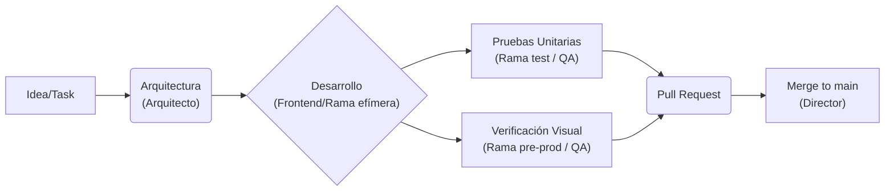
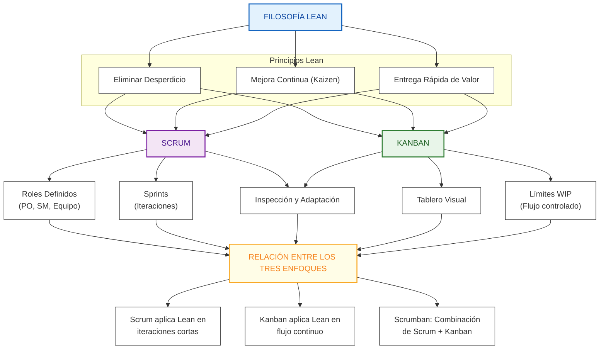

# Metodología de Desarrollo: Lean + IA

En VizApp, no seguimos Scrum rígido. Usamos una adaptación de **Lean Software Development** potenciada por agentes de Inteligencia Artificial.

## 1. Filosofía: "Component-Driven"
El proyecto se construye pieza por pieza (bloques). No intentamos construir todo el edificio a la vez; terminamos una habitación (bloque) antes de pasar a la siguiente.

### Principios Clave:
-   **WIP Limitado**: Trabaja en una sola cosa a la vez. No abras 5 PRs simultáneas.
-   **Just-in-Time Decisions**: Planifica la arquitectura de un bloque justo antes de codificarlo, no meses antes.
-   **Calidad Integrada**: Los tests y la verificación visual son parte del desarrollo, no una fase posterior.

## 2. El Ecosistema de Agentes

El desarrollo está potenciado por agentes de IA, cuyos roles formales están definidos en el Plan de Proyecto (`metodologia.md`):

| Agente Formal | Comandos (Slash) | Rol en el Día a Día |
| :--- | :--- | :--- |
| **Arquitecto / Verificador** | `/agente-arquitecto`, `/sub-agente-arquitecto-verificador` | Úsalo antes de empezar para proponer estructura y validar el enfoque (Reglas de Oro). |
| **Frontend** | *Uso General* | Desarrollo práctico (React, Tailwind, interactividad). |
| **QA / Tester** | `/sub-agente-qa`, `/sub-agente-tester` | Úsalo para generar tests (Vitest/Playwright) o verificar flujos completos de UI. |
| **Documentador / Content** | `/sub-agente-documentador` | Úsalo al final del bloque para actualizar la documentación técnica y contenidos. |

## 3. Flujo de Trabajo y Ramas (Git Flow)

Nuestro flujo técnico se alinea con la estrategia de ramas formal descrita en `metodologia.md`:

1.  **Especificación**: Generamos o leemos el plan (Arquitecto).
2.  **Coding**: Implementamos en ramas efímeras (`feature/*`, `fix/*`).
3.  **Verificación**: Las PRs se dirigen primero a `test` (para tests automáticos) y luego a `pre-prod` (auditoría visual).
4.  **Entrega**: Una vez validados los criterios funcionales y humanos, el Director integra en `main` (Producción).

## 4. Relación con la Gestión PMO (Scrumban + MÉTRICA v3)

Aunque internamente operamos bloque por bloque ("Component-Driven" y Lean), nuestro trabajo reporta a un marco formal **Scrumban + MÉTRICA v3**. 

### La Capa de Traducción Lean -> Scrumban

| Metodología de Desarrollo (Interna) | Metodología de Gestión (PMO / Scrumban) | Descripción / Equivalencia |
| :--- | :--- | :--- |
| **Batch de Bloques Lean** | **Sprint (2 semanas)** | Seleccionamos los bloques que nuestro WIP limit nos permite ejecutar en el Sprint. |
| **Sync de Bloqueos Diarios** | **Daily Standup / Tablero Kanban** | El trabajo de los agentes se mueve visualmente por el tablero. Solo reportamos impedimentos humanos. |
| **Complejidad de Agentes** | **Story Points** | Estimamos esfuerzo según el grado de intervención de los diferentes agentes (ver tabla abajo). |
| **Workflow de Agentes Completado** | **Definition of Done (DoD)** | El código ha pasado por `test`, `pre-prod`, está documentado y tiene visto bueno (PR Approved). |

### Tabla de Complejidad (Story Points)

| Puntos | Complejidad de Intervención IA | Ejemplo |
| :--- | :--- | :--- |
| **1 pt** | Trivial | Cambios de texto o estilos CSS. Lo hace Desarrollo sin agentes especiales. |
| **2 pts** | Simple | Crear una variante UI. (Requiere Agente Frontend). |
| **3 pts** | Media | Feature con lógica nueva. (Agente Frontend + QA / Tester). |
| **5 pts** | Alta | Nuevo Bloque completo (Editor + Player). (Arquitecto + Frontend + QA + Documentador). |
| **8 pts** | Muy Alta | Refactorización de arquitectura core. (Requiere alta supervisión humana). |

## 5. Mapa Conceptual: Ecosistema Lean-Agile

