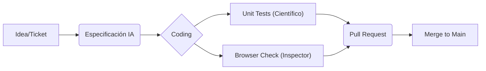

# Metodología de Desarrollo: Lean + IA

En VizApp, no seguimos Scrum rígido. Usamos una adaptación de **Lean Software Development** potenciada por agentes de Inteligencia Artificial.

## 1. Filosofía: "Component-Driven"
El proyecto se construye pieza por pieza (bloques). No intentamos construir todo el edificio a la vez; terminamos una habitación (bloque) antes de pasar a la siguiente.

### Principios Clave:
-   **WIP Limitado**: Trabaja en una sola cosa a la vez. No abras 5 PRs simultáneas.
-   **Just-in-Time Decisions**: Planifica la arquitectura de un bloque justo antes de codificarlo, no meses antes.
-   **Calidad Integrada**: Los tests y la verificación visual son parte del desarrollo, no una fase posterior.

## 2. El Ecosistema de Agentes
No estás solo. Tienes un equipo de agentes especializados para ayudarte:

| Agente | Code Name | Rol y Cuándo Invocarlo |
| :--- | :--- | :--- |
| **Arquitecto** | n/a | `/agente-arquitecto`. Úsalo antes de empezar una feature grande para validar tu enfoque. |
| **Inspector** | QA | `/sub-agente-qa`. Úsalo cuando termines una UI para verificar flujos visuales. |
| **Científico** | Tester | `/sub-agente-tester`. Úsalo mientras codificas lógica compleja para generar tests unitarios. |
| **Bibliotecario** | Docs | `/sub-agente-documentador`. Úsalo al final de tu sesión para actualizar la documentación. |
| **Supervisor** | Optimizador | `/agente-optimizador`. El Lead lo ejecuta periódicamente para auditar la salud del proyecto. |

## 3. Flujo de Trabajo Típico (Workflow)

1.  **Especificación**: Usa la IA para generar un `implementation_plan.md`.
2.  **Coding**: Implementa el código en tu rama `feat/...`.
3.  **Verificación**:
    -   Pasa los tests unitarios.
    -   Verifica visualmente.
4.  **Entrega**: Abre PR y espera aprobación del Supervisor.

**¿Por qué esto y no Scrum?**
Scrum añade mucha burocracia (Dailies, Sprints rígidos, Estimaciones en Puntos) que suele frenar a equipos pequeños y ágiles que usan IA. Con las herramientas que tenemos, la velocidad de implementación es muy alta. Un sprint de dos semanas se siente eterno cuando puedes crear un bloque complejo en 4 horas con ayuda de la IA.

## 4. Adaptación a SCRUM (The Translation Layer)
Si se requiere trabajar bajo un marco Scrum formal, utilizamos esta "Capa de Traducción" para reportar nuestro trabajo sin sacrificar la agilidad interna.

### Diccionario de Traducción

| Concepto Scrum | Equivalente Interno (VizApp) | Descripción |
| :--- | :--- | :--- |
| **Sprint (2 semanas)** | **Batch de Bloques** | Seleccionamos un conjunto de bloques/features que sabemos que podemos completar. No nos detenemos si acabamos antes; tomamos del backlog. |
| **Daily Standup** | **Sync de Bloqueos** | Solo reportamos impedimentos. No detallamos *cómo* lo hicimos (ej: "usé el agente X"), solo el resultado ("Feature Y lista"). |
| **Story Points** | **Complejidad de Agentes** | Estimamos basándonos en cuántos agentes se necesitan para la tarea. |
| **Definition of Done (DoD)** | **Workflow Integrado** | Una tarea está `Done` cuando pasa el `Unit Check` (Científico) y el `Browser Check` (Inspector). |

### Tabla de Story Points (Estimación)

| Puntos | Complejidad | Ejemplo |
| :--- | :--- | :--- |
| **1 pt** | Trivial | Cambios de texto, estilos CSS simples. (Lo hace el IDE/Copilot). |
| **2 pts** | Simple | Crear una variante de un componente existente. (Un agente). |
| **3 pts** | Media | Feature con lógica nueva. Requiere `specs` y tests unitarios. (Tester + Dev). |
| **5 pts** | Alta | Nuevo Bloque completo (Editor + Player + Tests). Requiere Arquitecto. |
| **8 pts** | Muy Alta | Refactorización de arquitectura core. Riesgo alto. (Supervisor + Arquitecto). |
