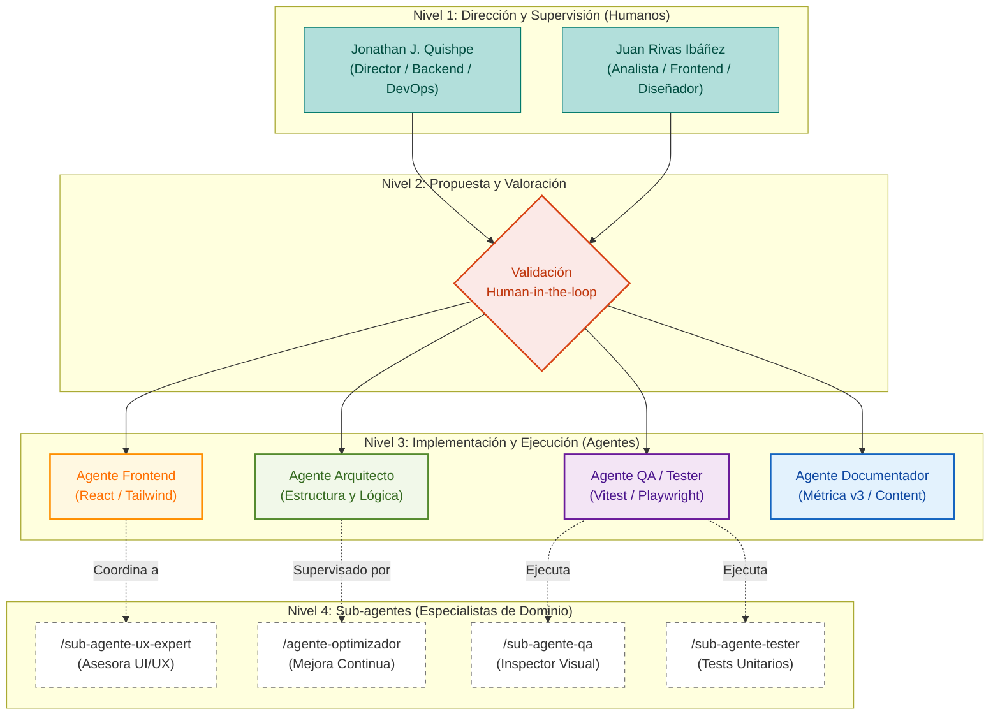

# METODOLOGÍA DE GESTIÓN DEL PROYECTO

> **Extracto del Plan de Proyecto:** Viz-App
> **Documento:** Plan de Proyecto - CRISP-DM (Grupo 002)

---

## 3.3 Responsabilidades y Funciones de los Interesados (Estructura de 4 Niveles)

Dada la naturaleza híbrida del equipo, las tareas se han distribuido en una jerarquía de cuatro niveles operativos para maximizar la eficiencia de los **agentes de Inteligencia Artificial (IA)**, manteniendo un estricto control humano sobre la calidad (estimado entre 5 y 10 horas semanales de supervisión).

### 3.3.1 Nivel 1: Dirección y Supervisión (Humanos)

*   **Jonathan Javier Quishpe Maldonado** (Director / Backend / DevOps)
    *   Ejerce como la autoridad máxima para aprobar y realizar fusiones (*merges*) tanto en la rama principal (`main`) como en la de pre-producción (`pre-production`).
    *   Supervisa la arquitectura de datos y la integración con las APIs externas, como servicios de síntesis de voz (TTS) o modelos de lenguaje (LLM).
    *   Gestiona la infraestructura para el despliegue del proyecto y administra el flujo de CI/CD.

*   **Juan Rivas Ibáñez** (Analista / Frontend / Diseñador)
    *   Supervisa la fidelidad del diseño visual y garantiza una excelente experiencia de usuario (UX).
    *   Valida la lógica de los componentes de Frontend.
    *   Asume la responsabilidad del análisis funcional y vela por el cumplimiento de los requisitos del sistema.

### 3.3.2 Nivel 2: Propuesta y Valoración (Human-in-the-loop)

*   **Validación Cruzada**: Todo el trabajo entregado por los agentes (Nivel 3) converge en este nodo. Representa el punto de iteración obligatoria (aprobación de Pull Requests) donde el equipo humano revisa el resultado técnico y visual antes de su pase a Producción/Integración.

### 3.3.3 Nivel 3: Agentes Coordinadores (IA)

Son los responsables globales ("Tech Leads") de cada área de conocimiento. Operan al mismo nivel jerárquico y se auditan mutuamente (ej. QA audita a Frontend).
*   **Agente Arquitecto / Verificador**: Propone la estructura de archivos y verifica la paridad técnica con las "reglas de oro" del proyecto.
*   **Agente Frontend**: Desarrollo práctico de componentes con React, Tailwind CSS y lógica de interactividad.
*   **Agente QA / Tester**: Genera automáticamente suites de pruebas y audita los flujos visuales construidos por el Frontend actuando como una fuerza complementaria.
*   **Agente Documentador / Content**: Redacta manuales técnicos, elabora la memoria del proyecto y estructura contenidos pedagógicos.

### 3.3.4 Nivel 4: Sub-agentes Especializados (IA)

Son herramientas o perfiles hiper-especializados (invocados vía *slash commands* como `/sub-agente-ux-expert` o `/sub-agente-tester`). No tienen visión global del proyecto y deben ser coordinados o delegados por los Agentes de Nivel 3 para resolver tareas delimitadas.

### 3.3.5 Diagrama de Estructura Organizativa (Híbrida)

---

## 4. Metodología de Gestión del Proyecto

Para maximizar la eficiencia del equipo híbrido, la gestión se rige por un marco que combina los estándares de **MÉTRICA v3** con una aproximación ágil basada en **Scrumban**.

### 4.1 Enfoque Metodológico (Scrumban + MÉTRICA v3)

1.  **MÉTRICA v3**: Proporciona el marco de ingeniería (Planificación PSI, Análisis ASI y Diseño DSI).
2.  **Scrum**: Estructura el tiempo en **Sprints de 2 semanas** y planificación de hitos.
3.  **Kanban**: Gestión visual del flujo diario de los agentes IA, limitando el **WIP (Work In Progress)** para evitar cuellos de botella en la revisión humana.

### 4.2 Tabla de Mapeo (Herramienta PMO)

| Hito Oficial Métrica v3 | Fecha Límite | Correspondencia Ágil / Artefacto Híbrido | Actividades Clave (Lean/Scrumban) |
| :--- | :--- | :--- | :--- |
| **PSI** (Planificación) | 12 de marzo | Vision, Product Backlog, Trello Setup. | Alcance, metodología, EDT, recursos y riesgos. |
| **ASI** (Análisis) | 9 de abril | Refinamiento del Backlog, User Story Mapping. | Mínimo 20 casos de uso. Modelado de requisitos Lean. |
| **DSI** (Diseño) | 30 de abril | Arquitectura y Sprint de Diseño Técnico. | Modelo de datos (5+ entidades), integraciones RESTful. |
| **Prototipo** | 13 de mayo | Incremento de Producto (Mockup interactivo). | Construcción del prototipo navegable y pantallas clave. |

### 4.3 Gestión de la Configuración y Flujo de Ramas (Git Flow)

Para aislar posibles alucinaciones de la IA, se establece una política estricta de ramas:

*   **`main` (Producción)**: Rama base estable. Solo escrita por el Director (Jonathan Quishpe).
*   **`pre-prod` (Integración)**: Funcionalidades validadas del Sprint actual para pruebas y auditoría visual.
*   **`test` (Pruebas unitarias)**: Rama temporal donde el Agente QA evalúa el código antes de la revisión humana.
*   **Ramas Efímeras (`feature/*`, `fix/*`, `refactor/*`)**: Espacios de trabajo aislados para agentes IA. Al terminar, abren una Pull Request (PR) hacia `test` o `pre-prod`.

### 4.4 Definición de "Hecho" (Done)

Una tarea solo se mueve a **Done** cuando cumple:

*   **Criterio Técnico**: El código compila sin errores ni advertencias.
*   **Criterio de Pruebas**: Todos los tests unitarios (previos y nuevos) pasan con éxito.
*   **Criterio Funcional**: Documentación adecuada en archivos Markdown.
*   **Criterio Humano**: Aprobación explícita (PR approved) de Jonathan o Juan tras code review.

### 4.5 Capa de Ejecución Técnica (Desarrollo)

Para conocer la operativa técnica del día a día, la guía de comandos de agentes de IA y la filosofía de implementación (*Lean Software Development* aplicada al uso de IA en código), el equipo se apoya en el documento **`METHODOLOGY.md`** que detalla la relación granular entre las *User Stories*, los puntajes de esfuerzo (*Story Points* basados en automatización) y el flujo de los agentes.